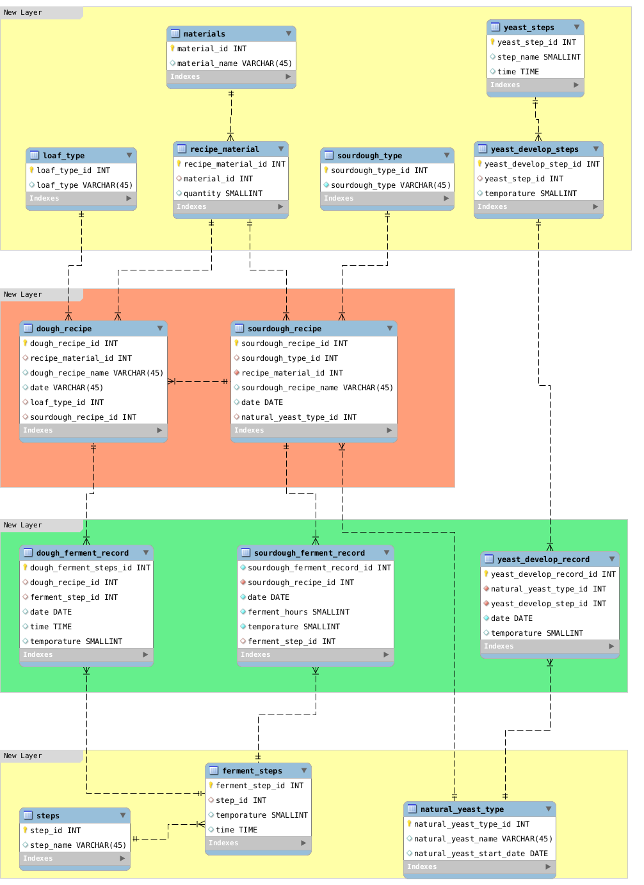

home_made_delicious
===================

Home-made delicious and recipes

From a dough to a delicious traditional loaf is a long way to go. Especially when you want a cracking surface, a beautiful cheese like structure, and a strong flavour, it used to mean a long time fermentation, a carefully cuting & shaping, an accurate baking... every single mistake would impact your product negatively. 

A strong flavour usually means a long time fermentation, and it also means big impact from the environment, especially environment temporature. I used to use natural yeast to ferment my dough. So I also need to take care my yeast everyday. 
-- 

From a dough to a delicious traditional loaf means a lot of work to do. Especially when you want a cracking surface, a beautiful cheese like structure, and a strong flavour. Long time fermentation lead to a strong flavour while extra fermmentation lead to extra acid. So a good balance is quite necessary. 

Also a long time fermmentation means deep relationship with environment, I mean weathers, seasons which leads to different temporatures. I have to make different reactions, in advance.

Especially, I used to use natural yeast to ferment my dough. So I also need to take care my yeast everyday, and try to keep it in the most active status on the D day while keep them in the rest, even in a sleep in other days.

I used to use a weekly plan to make sure I can get my loaf done in the weekend. As time went on, I find it is not enough.  Long time data collection is quite necessary for me to deal with accidental issues ( Yes, it really comes. We've been in cold spring for 2 weeks). That is why I made this database schema for my loaf.

And there is another benefit from the database. As Fred Brooks, in Chapter 9 of The Mythical Man-Month, said this:

    Show me your flowchart and conceal your tables, and I shall continue to be mystified. Show me your tables, and I won't usually need your flowchart; it'll be obvious.

I may not need to write recipes for each loaf separately. You get these tables, the recipes will be obvious. :-)

